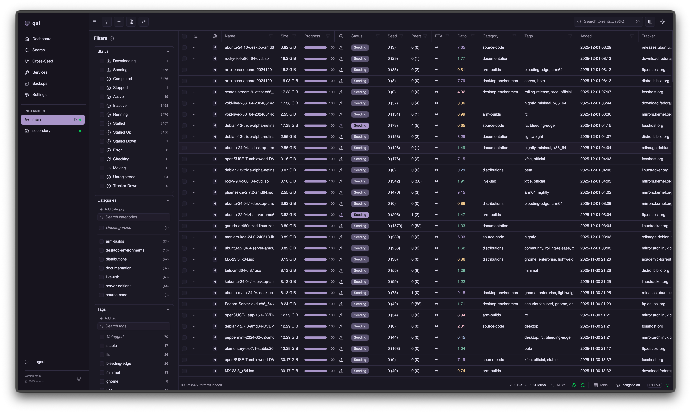

# qui

A fast, modern web interface for qBittorrent. Supports managing multiple qBittorrent instances from a single, lightweight application.

<div align="center">
  
</div>

## Documentation

Full documentation available at **[getqui.com](https://getqui.com)**

## Quick Start

### Linux x86_64

```bash
# Download and extract the latest release
wget $(curl -s https://api.github.com/repos/autobrr/qui/releases/latest | grep browser_download_url | grep linux_x86_64 | cut -d\" -f4)
sudo tar -C /usr/local/bin -xzf qui*.tar.gz qui

# Run
qui serve
```

The web interface will be available at http://localhost:7476

### Docker

```bash
docker run -d \
  -p 7476:7476 \
  -v $(pwd)/config:/config \
  ghcr.io/autobrr/qui:latest
```

## Features

- **Single Binary**: No dependencies, just download and run
- **Multi-Instance Support**: Manage all your qBittorrent instances from one place
- **Fast & Responsive**: Optimized for performance with large torrent collections
- **Cross-Seed**: Automatically find and add matching torrents across trackers
- **Automations**: Rule-based torrent management with conditions and actions
- **Backups & Restore**: Scheduled snapshots with multiple restore modes
- **Reverse Proxy**: Transparent qBittorrent proxy for external apps
- **Multi-Language**: Available in English, German, French, Italian, Czech, Ukrainian, Korean, Brazilian Portuguese, Simplified Chinese, and Traditional Chinese, with automatic browser-language detection

## Community

Join our community on [Discord](https://discord.autobrr.com/qui)!

## Support

- [GitHub Discussions](https://github.com/autobrr/qui/discussions/new/choose) - Feature requests and bug reports
- [GitHub Issues](https://github.com/autobrr/qui/issues) - Work in progress

## Support Development

qui is developed and maintained by volunteers. Your support helps us continue improving the project.

### Premium Themes

Purchase premium themes from **Settings → Premium Themes** in your qui instance. The checkout page shows your license key.
If you donate with crypto, verify your transaction at [crypto.getqui.com](https://crypto.getqui.com/) to receive a 100% discount code for premium themes.
A license also unlocks custom themes, which you can write yourself or take from [qui-community-themes](https://github.com/autobrr/qui-community-themes).

### Donations

If you'd like to support development beyond theme purchases, donations are always appreciated.

- **soup**
  - [Patreon](https://www.patreon.com/c/s0up4200)
  - [GitHub Sponsors](https://github.com/sponsors/s0up4200)
  - [Buy Me a Coffee](https://buymeacoffee.com/s0up4200)
  - [Ko-fi](https://ko-fi.com/s0up4200)
- **zze0s**
  - [GitHub Sponsors](https://github.com/sponsors/zze0s)
  - [Buy Me a Coffee](https://buymeacoffee.com/ze0s)

#### Cryptocurrency

Verify your crypto donation at [crypto.getqui.com](https://crypto.getqui.com/) to receive a 100% discount code for premium themes.

#### Bitcoin (BTC)
- soup: `bc1qfe093kmhvsa436v4ksz0udfcggg3vtnm2tjgem`
- zze0s: `bc1q2nvdd83hrzelqn4vyjm8tvjwmsuuxsdlg4ws7x`

#### Ethereum (ETH)
- soup: `0xD8f517c395a68FEa8d19832398d4dA7b45cbc38F`
- zze0s: `0xBF7d749574aabF17fC35b27232892d3F0ff4D423`

#### Litecoin (LTC)
- soup: `ltc1q86nx64mu2j22psj378amm58ghvy4c9dw80z88h`
- zze0s: `ltc1qza9ffjr5y43uk8nj9ndjx9hkj0ph3rhur6wudn`

#### Monero (XMR)
- XMR discount codes are handled manually. Reach out on [Discord](https://discord.autobrr.com/qui) or email `s0up4200@pm.me`.
- soup: `8AMPTPgjmLG9armLBvRA8NMZqPWuNT4US3kQoZrxDDVSU21kpYpFr1UCWmmtcBKGsvDCFA3KTphGXExWb3aHEu67JkcjAvC`
- zze0s: `44AvbWXzFN3bnv2oj92AmEaR26PQf5Ys4W155zw3frvEJf2s4g325bk4tRBgH7umSVMhk88vkU3gw9cDvuCSHgpRPsuWVJp`

---

For other currencies or donation methods, [reach out on Discord](https://discord.autobrr.com/qui).

## Contributing

Contributions are welcome.

See [`CONTRIBUTING.md`](.github/CONTRIBUTING.md) for the development and test workflow.

## Alternatives

If qui does not fit your setup, these projects offer different approaches:

- [VueTorrent](https://github.com/VueTorrent/VueTorrent) is a modern, responsive alternative WebUI.
- [iQbit](https://github.com/ntoporcov/iQbit) is a mobile-focused WebUI and PWA.
- [Flood](https://github.com/jesec/flood) supports qBittorrent and other torrent clients.
- [qBitController](https://github.com/Bartuzen/qBitController) is a native app for Android, iOS, Linux, macOS, and Windows.

The qBittorrent wiki includes a longer [list of community WebUIs](https://github.com/qbittorrent/qBittorrent/wiki/List-of-known-alternate-WebUIs).

## License

GPL-2.0-or-later
